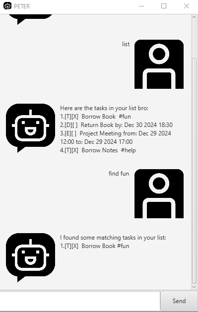

# Peter: User Guide to Your Task Management Chatbot

Peter is a text-based "BRO" chatbot designed to help you manage your tasks efficiently. Whether you need to add, delete, list, or find tasks, Peter has you covered. 
The chatbot supports various types of tasks, including todos, deadlines, and events, and allows you to tag as well as toggle tasks as completed.

## Features

- **Add Tasks**: Create new tasks of different types:
  - **Todos**: Simple tasks without any time specifications.
  - **Deadlines**: Tasks with a specific end datetime.
  - **Events**: Tasks with a start and end datetime.
  - All tasks will be persisted on a locally stored file for future retrival.
- **List Tasks**: View all tasks or filter them based on their type (todos, deadlines, events).
- **Delete Tasks**: Remove tasks from your list by specifying the index after listing.
- **Tag Tasks**: Add tags (e.g., `#fun`, `#urgent`) to tasks for easier organization and retrieval.
- **Find Tasks**: Search for tasks by name or tag to quickly locate what you need.
- **Toggle Completion**: Mark tasks as completed or not completed to track your progress throughout the day.

## Actual Usage of Features

1. **Adding Tasks**:
   - Do use the following date format `2024-12-30 18:30` for all date inputs.
   - To add a todo: `todo <task_name>`
   - To add a deadline: `deadline <task_name> /by <end date>`
   - To add an event: `event <task_name> /from <start date> /to <end date>`

2. **Deleting Tasks**:
   - To delete a task: `delete <task_index>`

3. **Listing Tasks**:
   - To list all tasks: `list`

4. **Tagging Tasks**:
   - To tag a task: `tag <task_index> /<tag>`

5. **Finding Tasks**:
   - To find tasks by name: `find /<task_name>`
   - To find tasks by tag: `find /<tag>`

6. **Toggling Completion**:
   - To mark a task as completed: `mark <task_index>`
   - To mark a task as not completed: `unmark <task_index>`